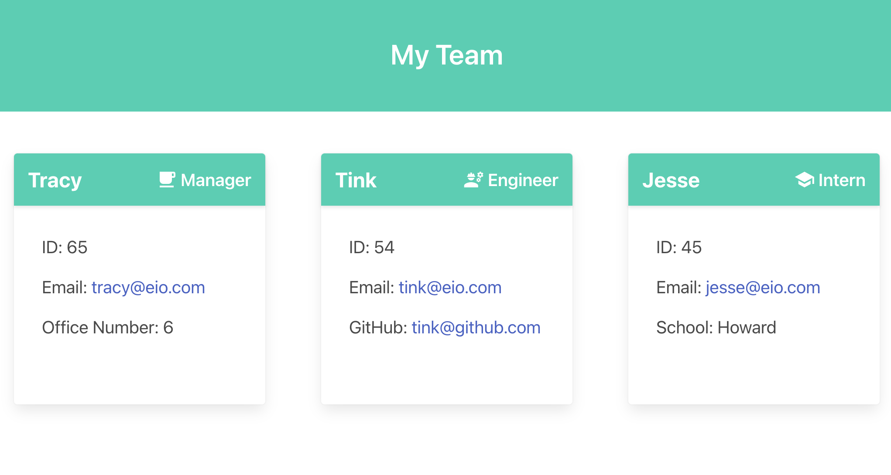

# musical-enigma

## Description

musical-enigma is a command-line application that takes in information about employees on a software engineering team and generates an HTML webpage that displays summaries for each person. 

## Table of Contents
* [Installation](#installation)
* [Usage](#usage)
* [Application Demo ](#application-demo)

## Installation

To create your own team-profile generator app, `git clone` the repo so you have the project on your local development environemnt.

`Jest` and `Inquirer` packages will need to be installed to run unit tests and collect input from the user.

## Usage

The application can be invoked by using the `node index.js` command.

## Application Demo

The following image captures the html page generated from the command-line application:

Use the following link to find the demo video of the back end of musical-enigma:

